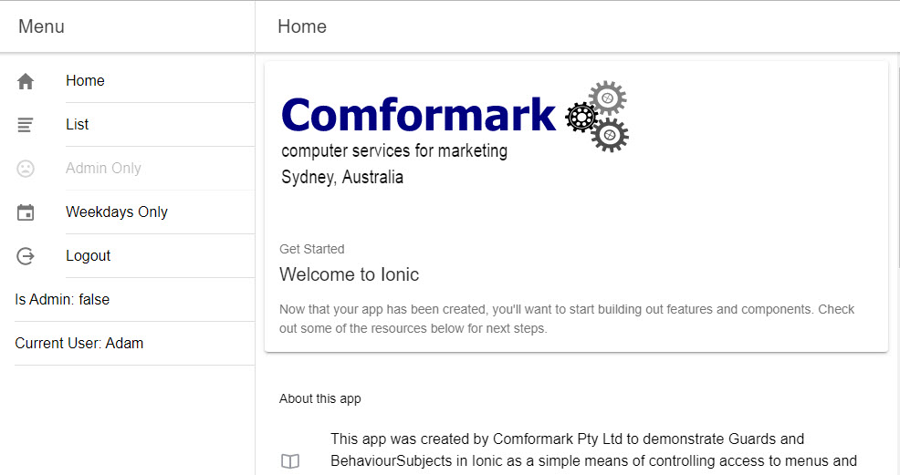

# gwbionic4guards
Ionic 4 app demonstrating the use of a Guard

This app was created by Comformark Pty Ltd to demonstrate Guards and BehaviourSubjects in Ionic as a simple means of controlling access to menus and pages in an Ionic 4 application.

There are three login access levels, 0, 1 and 4. "Adam", "Anne" etc have access level 1, "Admin" has access level 4. 

These values are assigned, on login, to a BehaviourSubject which is subscribed to from the app.component and the menu is updated according to the access level. 

The "List" page is only visible to logged-in users.

An Angular Guard function controls access to pages via values set in the app-routing.module for each route. The Guard function uses the values contained in the BehaviourSubject, and also uses a simple function to restrict access based on the day of the week.

The app also demonstrates how to use navigation parameters, so that after login the user is directed to whichever page they tried to access before login.

A tutorial describing the app functionality is available at the <a href="https://www.comformark.com.au/news/post/ionic-4-guards-and-behavioursubjects-to-control-access-to-your-app" target="_blank" alt="Tutorial for gwb Ionic 4 Guards">Comformark Pty Ltd website</a>
